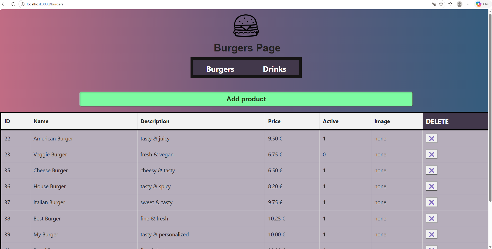
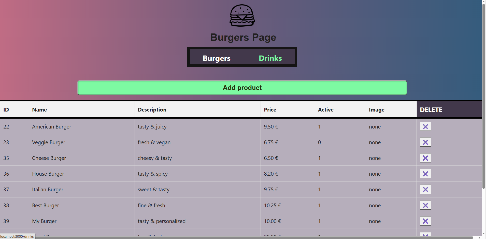
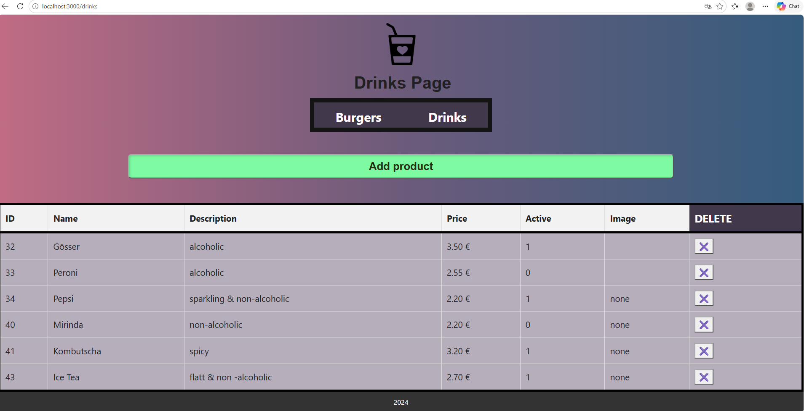
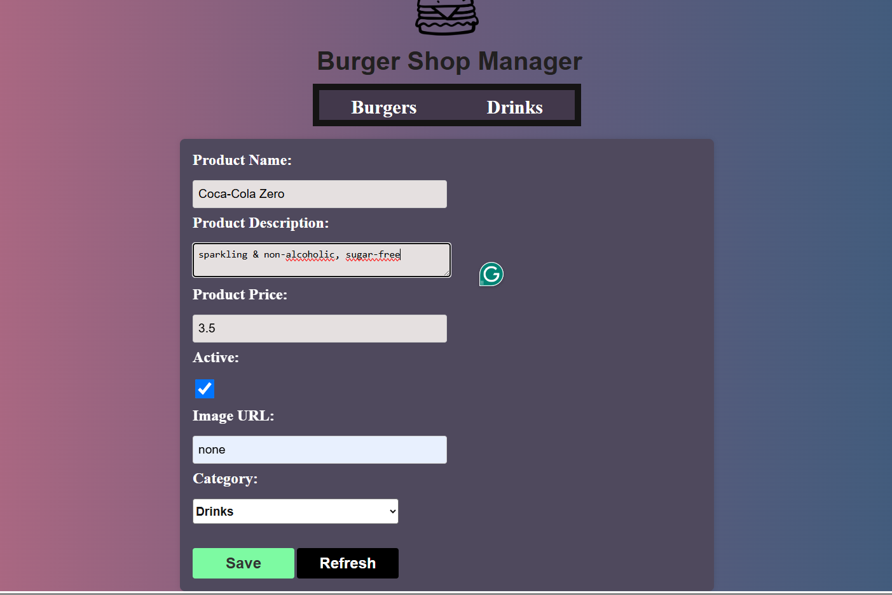
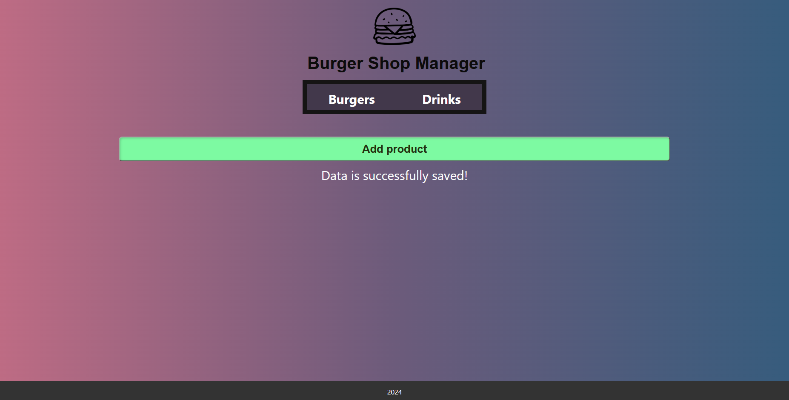
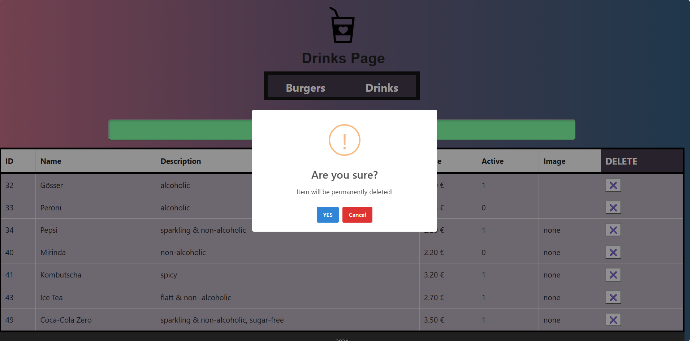

# Menu Management – Project Overview

A web application for managing a digital restaurant menu.

## Technologies

Node.js · Express.js · EJS · MySQL · HTML · CSS · JavaScript · Bootstrap

## Main Features

- Create and display menu products
- Organize products into Burgers and Drinks
- Store and retrieve data from MySQL
- Delete products with confirmation dialogs
- Responsive user interface

## Application Preview

### Menu Overview - Burgers Page

### Navigate To Drinks Page

### Menu Overview - Drinks Page

### Add Product

### Delete Product

## GitHub

Source code and technical documentation are available in this repository : [https://github.com/vlasdana/burgers-shop](https://github.com/vlasdana/burgers-shop)
